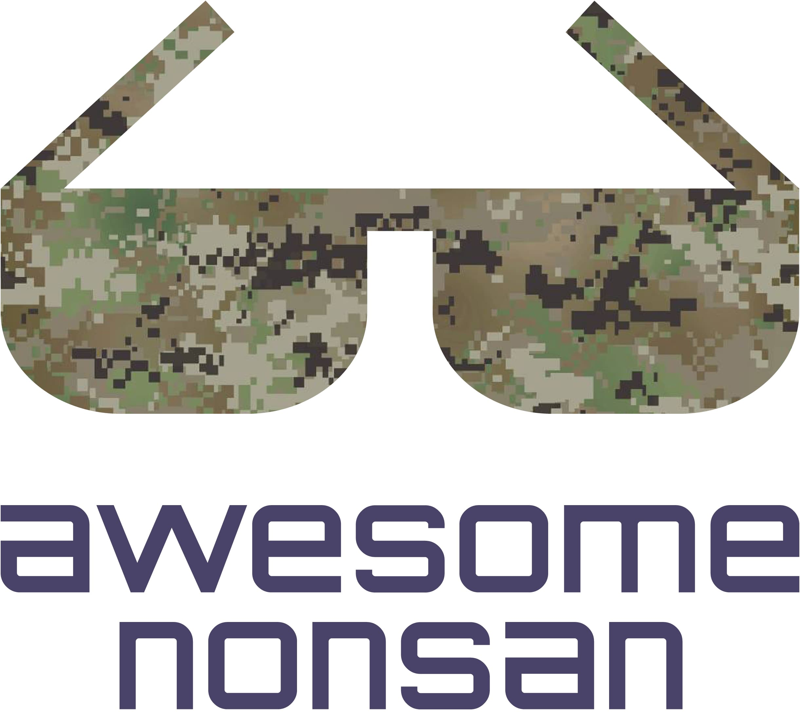

  
   
   
   
  

## Contents

- [준비물](#준비물)
  - [필수](#필수)
  - [추천](#추천)
  - [비추천](#비추천)
  - [금지](#금지)
- [팁](#팁)
  - [생활](#생활)
  - [훈련](#훈련)
  - [기타](#기타)
- [관련 자료](#관련-자료)

## 준비물

- [필수](#필수)
- [추천](#추천)
- [비추천](#비추천)
- [금지](#금지)

### 필수
> 가져가지 않으면 매우 피곤해지는 품목들
> 잘못하면 입영을 못하는 불상사가 발생할 수도 있음

- 신분증
	- 주민등록증, 운전면허증 등
- 입영통지서
- 나라사랑카드
  - 신분증을 가져가면 필수는 아님
  - PX에서 개인 체크/신용카드도 사용 가능

### 추천
> 가져가지 않아도 훈련소에서 나눠 주지만 퀄리티가 안 좋거나
> 꼭 가져가진 않아도 되지만 가져가면 매우 큰 도움이 되는 품목들

- 세면용품
	- 샴푸, 바디워시, 폼클렌징, 샤워타월, 수건, 칫솔/치약 등
- 기초 스킨 케어
  - 로션, 스킨, 립밤, 선크림, 핸드크림 등
- 손목 시계
  - 아날로그 보다는 디지털
  - 추천 - [지샥 머드맨](https://www.coupang.com/vp/products/38065513?itemId=140354969&vendorItemId=3003469445&q=%EC%A7%80%EC%83%A5+%EB%A8%B8%EB%93%9C%EB%A7%A8&itemsCount=36&searchId=9e34fbb1625d4cf7ad98408743e2e89e&rank=0&isAddedCart=)
- 물티슈
  - 총기 손질, 위장 지울 때 빛을 발함
  - 입소 때 내라고 할 수 있으나 안 내는거 추천
- 우표
  - 우표를 붙이지 않아도 군사 우편을 보낼 수 있지만 받기까지 오래걸림
- 약
  - 평소에 복용하던 약이 있다면 처음에 낸 후에 정해진 시간마다 받아서 복용할 수 있음
- 이어플러그
  - 훈련소에서 나눠주는건 총 소리는 다 들리고 분대장 말은 안 들림
- 위장크림
  - 마찬가지로 나눠주지만 잘 안 발림
  - 추천 - [이니스프리 위장크림](http://www.11st.co.kr/product/SellerProductDetail.tmall?method=getSellerProductDetail&prdNo=1731820018&gclid=EAIaIQobChMInOzb6tyz4gIVCWoqCh3qmwpGEAQYASABEgIrHPD_BwE&utm_term=&utm_campaign=%B1%B8%B1%DB%BC%EE%C7%CEPC+%C3%DF%B0%A1%C0%DB%BE%F7&utm_source=%B1%B8%B1%DB_PC_S_%BC%EE%C7%CE&utm_medium=%B0%CB%BB%F6)
- 면봉
  - 총기 손질 끝판왕
- 라이트펜
- 책
  - 생활관에 생각보다 많지만 읽을만한 책은 순식간에 없어짐
- 큰 가방
  - 퇴소 시 짐이 생각보다 많음
  - 퇴소 전 쇼핑백 구매 기회를 주기 때문에 반드시 가져가진 않아도 됨
- 휴지
  - 초도보급으로 2개씩 주지만 부족할 수 있음

### 비추천
> 가져가지 않아도 훈련소에서 나눠 주는게 퀄리티가 좋거나 가져가 봤자 쓸모가 없는 품목들

- 속옷
  - 상하의 3벌씩 나눠줌
- 여분의 옷
- 필기도구
  - 볼펜, 유성 매직 관물함에 있음
- 현금
  - PX에서 쓸 수도 없고 전부 본인 계좌로 입금해줌
- 세면백
- 손톱/발톱깎이
- 바늘/실
- 면도기
- 마스크
  - 훈련소에서 나눠주는게 좋진 않지만 가지고 가 봤자 사용 불가
- 편지지, 편지봉투
  - 예쁜걸 쓰고 싶으면 가져가도 됨(대신 군사 우편 봉투가 아니면 우표 필수)

### 금지
> 가져가면 어차피 반납해야 하는 품목들
> 반납하지 않았다가 걸리면 퇴소 당할 수도 있음

- 담배
  - 라이터, 전자 담배 포함
- 흉기
  - 칼, 송곳 등 날카롭고 뾰족한 물건들
- 전자제품
  - 핸드폰, 노트북, MP3, 태블릿, 카메라 등
- 외부 음식물

## 팁

- [생활](#생활)
- [훈련](#훈련)
- [기타](#기타)

### 생활

- TODO

### 훈련

- TODO

### 기타

- 머리를 자르고 들어가자
  - 안 자르고 들어가도 잘라주지만 그 전에 모든 이의 관심을 받을 수 있음
  - 너무 길게 자르고 들어가면 안에서 다시 밀린다. 입소 전날 자르는 기준으로 12mm가 마지노선

## 관련 자료

- [육군훈련소 홈페이지](http://www.katc.mil.kr/katc/)
- [나무위키](https://namu.wiki/w/%EC%9C%A1%EA%B5%B0%ED%9B%88%EB%A0%A8%EC%86%8C)

## License

